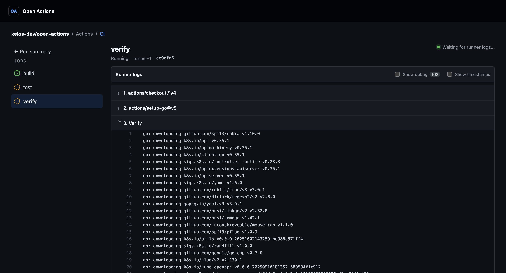
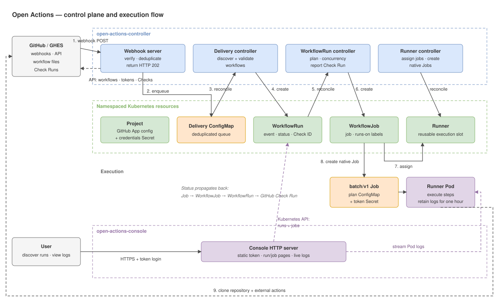

# Open Actions

Open Actions is an open, Kubernetes-native alternative to the GitHub Actions
control plane. It is designed for high-volume automation workloads whose
workflow requests can saturate that control plane even when runner capacity is
available. GitHub webhooks trigger supported workflows, which Open Actions
plans, schedules, and executes in the team's own Kubernetes cluster. GitHub
webhooks are the first source integration.



Open Actions implements a documented subset of GitHub Actions. See the
[Workflow API](docs/reference.md#workflow-api) for supported syntax and
constraints. Unsupported workflows fail explicitly.

## Architecture



The controller receives GitHub webhooks, creates `WorkflowRun` and `WorkflowJob`
resources, schedules jobs on matching `Runner` resources, and reports status
through GitHub Check Runs. Runners execute steps in Kubernetes Jobs and use the
standalone artifact service for workflow artifact uploads and downloads. The
Console shows runs, jobs, and live logs. Each `Project` defines an execution
domain and its GitHub App integration.

## Quickstart

This path installs the latest release, connects one GitHub App installation,
and creates one Linux runner. Before starting, you need:

- a Kubernetes 1.29 or newer cluster selected by your current kubeconfig
  context
- `curl`, Bash, `kubectl`, and Helm 3
- a default StorageClass; the artifact service requests a 20 Gi persistent
  volume by default
- Linux or macOS on AMD64 or ARM64 for the Open Actions CLI
- a stable public HTTPS URL that can route GitHub webhooks to the cluster
- permission to create a GitHub App and install it on the target repositories

### 1. Install the CLI and control plane

The installer downloads the latest CLI to `~/.local/bin` and verifies its
checksum:

```console
curl -fsSL https://raw.githubusercontent.com/kelos-dev/open-actions/main/hack/install.sh | bash
export PATH="${HOME}/.local/bin:${PATH}"
```

The CLI deploys the controller, artifact service, Console, and CRDs to the
current Kubernetes cluster through Helm:

```console
kubectl config current-context
open-actions install

kubectl rollout status deployment/open-actions-controller \
  --namespace open-actions-system --timeout=5m
kubectl rollout status statefulset/open-actions-artifacts \
  --namespace open-actions-system --timeout=5m
kubectl rollout status deployment/open-actions-console \
  --namespace open-actions-system --timeout=5m
```

The Helm release is named `open-actions`; the control-plane namespace is
`open-actions-system`.

### 2. Expose the webhook endpoint

Route your public HTTPS URL to the `open-actions-webhook` Service on port 80 in
the `open-actions-system` namespace. TLS must terminate at your ingress, load
balancer, or tunnel; the chart does not create an ingress or certificate.

A `GET` request should reach Open Actions and return `405 Method Not Allowed`;
the endpoint accepts signed GitHub `POST` requests only:

```console
curl -i https://open-actions.example.com/
```

### 3. Create and install the GitHub App

[Create a GitHub App](https://docs.github.com/en/apps/creating-github-apps/registering-a-github-app/registering-a-github-app)
with the HTTPS URL from the previous step as its webhook URL. Enable the
webhook, set a strong webhook secret, and grant:

- read and write access to Actions, Checks, Contents, Issues, Packages, Pull
  requests, and Commit statuses
- read access to Merge queues
- subscriptions to Push, Pull request, Merge group, Workflow run, Issues,
  Issue comment, Pull request review comment, Pull request review, Release, and
  Check run events

Generate a private key, then [install the
App](https://docs.github.com/en/apps/using-github-apps/installing-your-own-github-app)
on every repository whose workflows or private actions Open Actions will use.
Record the numeric App ID and installation ID. The installation ID is the
number after `/installations/` in the installation settings URL.

Each workflow job receives a token narrowed to the permissions requested by
its workflow and to its Project repository. External actions use a separate
short-lived token for repositories granted to the installation. See [External
actions](docs/reference.md#external-actions). Keep the default fork policy
unless fork code belongs to the installation's trust boundary.

### 4. Create a Project and runner

Set these values for the GitHub App you just installed:

```console
export OPEN_ACTIONS_NAMESPACE=open-actions
export GITHUB_APP_ID=12345
export GITHUB_APP_INSTALLATION_ID=67890
export GITHUB_APP_PRIVATE_KEY=/absolute/path/to/private-key.pem
printf 'GitHub webhook secret: '
read -rs GITHUB_WEBHOOK_SECRET
printf '\n'
```

Create a namespace for workflow resources and store the App credentials in
it. The Secret must be in the same namespace as the Project:

```console
kubectl create namespace "${OPEN_ACTIONS_NAMESPACE}" \
  --dry-run=client -o yaml | kubectl apply -f -
kubectl create secret generic open-actions-github-app \
  --namespace "${OPEN_ACTIONS_NAMESPACE}" \
  --from-file=private-key.pem="${GITHUB_APP_PRIVATE_KEY}" \
  --from-literal=webhook-secret="${GITHUB_WEBHOOK_SECRET}" \
  --dry-run=client -o yaml | kubectl apply -f -
unset GITHUB_WEBHOOK_SECRET
```

Create the Project and one runner:

```console
kubectl apply -f - <<EOF
apiVersion: actions.kelos.dev/v1alpha1
kind: Project
metadata:
  name: default
  namespace: ${OPEN_ACTIONS_NAMESPACE}
spec:
  source:
    type: GitHub
    github:
      appID: ${GITHUB_APP_ID}
      installationID: ${GITHUB_APP_INSTALLATION_ID}
      privateKeySecretRef:
        name: open-actions-github-app
        key: private-key.pem
      webhookSecretRef:
        name: open-actions-github-app
        key: webhook-secret
  workflowDirectory: .open-actions/workflows
---
apiVersion: actions.kelos.dev/v1alpha1
kind: RunnerSet
metadata:
  name: linux
  namespace: ${OPEN_ACTIONS_NAMESPACE}
spec:
  replicas: 1
  template:
    spec:
      projectRef:
        name: default
      execution:
        image: ghcr.io/kelos-dev/open-actions-runner:latest
        resources:
          requests:
            cpu: "1"
            memory: 1Gi
          limits:
            cpu: "2"
            memory: 2Gi
      labels:
        - self-hosted
        - linux
        - x64
        - ubuntu-latest
EOF

kubectl wait --for=condition=Configured project/default \
  --namespace "${OPEN_ACTIONS_NAMESPACE}" --timeout=2m
kubectl wait --for=condition=Ready runnerset/linux \
  --namespace "${OPEN_ACTIONS_NAMESPACE}" --timeout=2m
```

Each Runner executes one job at a time, and its labels must include every label
in the job's `runs-on` value. The standard runner image is based on Ubuntu
24.04. To add tools, build a [custom runner image](examples/runner/Dockerfile)
from the standard image. Use the [Docker Runner
sample](config/samples/actions_v1alpha1_docker_runner.yaml) for jobs that need
Docker.

### 5. Migrate a workflow

Open Actions supports a [subset of the GitHub Actions workflow
API](docs/reference.md#workflow-api). Check compatibility first, then copy one
workflow without deleting the original:

```console
mkdir -p .open-actions/workflows
cp .github/workflows/ci.yaml .open-actions/workflows/ci.yaml
```

Push the copy from a branch in a repository where the App is installed and
confirm its `Open Actions / .open-actions/workflows/ci.yaml` check passes.
GitHub Actions and Open Actions will run in parallel while both files exist.
Then update any required checks and delete `.github/workflows/ci.yaml`. Restore
that file to roll back.

To inspect runs in the Console, forward its Service and open
<http://localhost:8080>:

```console
kubectl port-forward --namespace open-actions-system \
  service/open-actions-console 8080:80
```

### Version-pinned installation

For a repeatable production or GitOps installation, select a version from
[Releases](https://github.com/kelos-dev/open-actions/releases) and install the
matching OCI chart directly. The chart version omits the release tag's `v`
prefix:

```console
export OPEN_ACTIONS_VERSION=v0.1.0
helm upgrade --install open-actions \
  oci://ghcr.io/kelos-dev/charts/open-actions \
  --version "${OPEN_ACTIONS_VERSION#v}" \
  --namespace open-actions-system \
  --create-namespace
```

Use that same release tag for each RunnerSet's runner image instead of
`latest`. See the [Helm
values](internal/manifests/charts/open-actions/README.md#values) to configure
storage, resources, image pull policies, or an externally exposed Console.

## Inspecting workflow runs

The CLI reads workflow runs and runner logs through the Kubernetes API using the
active kubeconfig context. It defaults to that context's namespace; use
`--namespace` to select another namespace or `--all-namespaces` when listing
runs.

```console
open-actions run list --namespace open-actions
open-actions run view RUN --namespace open-actions
open-actions run logs RUN --job JOB --namespace open-actions
open-actions run logs RUN --job JOB --follow --namespace open-actions
```

`JOB` may be the workflow-local job ID shown by `run view` or the WorkflowJob
resource name. An exact resource-name match takes precedence over a job ID.
`--job` may be omitted when the run contains exactly one job.
Completed runner logs remain available until the native Kubernetes Job is
deleted by its retention policy.

## API reference

See the [API reference](docs/reference.md) for Kubernetes resources, command-line
configuration, supported workflow syntax, and the webhook contract.

## Development

```console
make update     # Format, generate Go code and CRDs, and tidy modules.
make verify     # Check generated files, formatting, modules, and go vet.
make test       # Run unit and schema tests.
make build      # Build the CLI, controller, artifact service, Console, and runner binaries under bin/.
make image      # Build the controller, artifact service, Console, and runner images.
```

Install the control plane before running the end-to-end suite against the
cluster selected by the current Kubernetes context:

```console
make build WHAT=cmd/open-actions
bin/open-actions install --values config/e2e/values.yaml
kubectl apply -f config/e2e/fixture.yaml
kubectl wait --for=condition=Available --timeout=180s \
  --namespace open-actions-system \
  deployment/open-actions-controller \
  deployment/open-actions-console \
  deployment/github-fixture
kubectl rollout status statefulset/open-actions-artifacts \
  --namespace open-actions-system \
  --timeout=180s
make test-e2e
```

The suite expects the control plane and GitHub fixture to be ready before it
starts.
